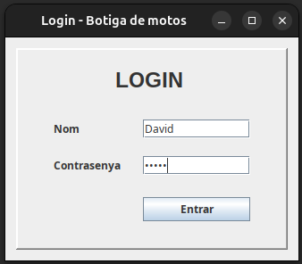
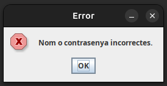
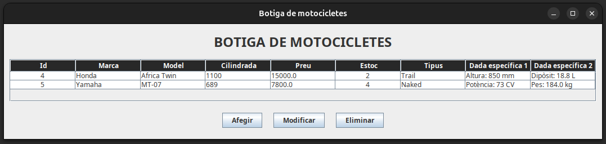
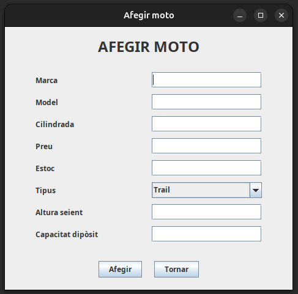
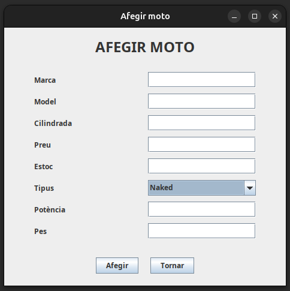
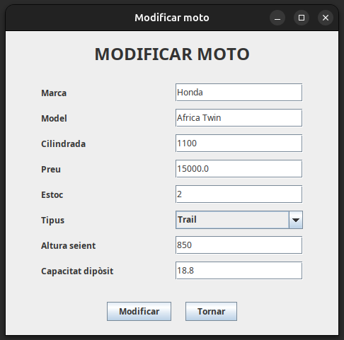
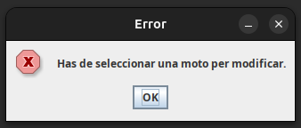
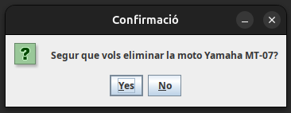

# Projecte final de Programació: Gestor d'una botiga de motocicletes

## 1. Context

Es vol desenvolupar una aplicació d'escriptori en **Java Swing** per gestionar l'estoc d'una botiga de motocicletes.

L'aplicació haurà de permetre iniciar sessió amb un usuari de l'aplicació i, un cop validat el login, gestionar les motos disponibles a la botiga.

---

## 2. Objectiu general

Crear una aplicació Java que permeti:

1. Fer login amb un usuari registrat.
2. Llistar totes les motocicletes de la botiga.
3. Afegir una motocicleta nova.
4. Modificar una motocicleta existent.
5. Eliminar una motocicleta existent.
6. Treballar amb una jerarquia de classes formada per una classe mare `Moto` i dues classes filles: `Trail` i `Naked`.

---

## 3. Estructura del projecte

El projecte s'ha d'organitzar en paquets, separant clarament les diferents capes de l'aplicació.

```text
Model_Negoci
    Usuari.java
    Moto.java
    Trail.java
    Naked.java

Model_Persistencia
    BaseDAO.java
    BDUtilDAO.java
    UsuariDAO.java
    MotoDAO.java

Vista
    LoginVista.java
    MotosVista.java
    AfegirMotoVista.java
    ModificarMotoVista.java

Controlador
    LoginControlador.java
    MotosControlador.java
    AfegirMotoControlador.java
    ModificarMotoControlador.java

Principal
    Principal.java
```
---

## 4. Model de negoci

### 4.1. Classe `Usuari`

La classe `Usuari` representa un usuari de l'aplicació.

Atributs mínims:

```text
id
nom
contrasenya
```

Aquesta classe s'utilitzarà per validar l'accés a l'aplicació des de la pantalla de login.

---

### 4.2. Classe abstracta `Moto`

La classe `Moto` serà la classe mare de la jerarquia.

Atributs comuns:

```text
id
marca
model
cilindrada
preu
estoc
```

A més, haurà de declarar un mètode abstracte:

```java
public abstract String getTipus();
```

Aquest mètode permetrà saber si una moto concreta és de tipus `Trail` o `Naked`.

---

### 4.3. Classe `Trail`

La classe `Trail` ha d'heretar de `Moto`.

Atributs específics:

```text
alturaSeient
capacitatDiposit
```

El mètode `getTipus()` haurà de retornar:

```text
Trail
```

---

### 4.4. Classe `Naked`

La classe `Naked` ha d'heretar de `Moto`.

Atributs específics:

```text
potencia
pes
```

El mètode `getTipus()` haurà de retornar:

```text
Naked
```

---

## 5. Base de dades

La base de dades haurà de tenir les taules següents:

```text
usuaris
motos
trail
naked
```

---

### 5.1. Taula `usuaris`

```text
id              INT AUTO_INCREMENT PRIMARY KEY
nom             VARCHAR(50) NOT NULL UNIQUE
contrasenya     VARCHAR(50) NOT NULL
```

L'aplicació haurà de crear un usuari inicial per poder entrar:

```text
nom: admin
contrasenya: admin
```

---

### 5.2. Taula `motos`

Aquesta taula guardarà les dades comunes de totes les motos.

```text
id              INT AUTO_INCREMENT PRIMARY KEY
marca           VARCHAR(50) NOT NULL
model           VARCHAR(50) NOT NULL
cilindrada      INT NOT NULL
preu            DOUBLE NOT NULL
estoc           INT NOT NULL
tipus           VARCHAR(20) NOT NULL
```

El camp `tipus` indicarà si la moto és `Trail` o `Naked`.

---

### 5.3. Taula `trail`

Aquesta taula guardarà només les dades específiques de les motos Trail.

```text
moto_id             INT PRIMARY KEY
altura_seient       INT NOT NULL
capacitat_diposit   DOUBLE NOT NULL
```

El camp `moto_id` ha d'estar relacionat amb `motos.id` mitjançant una clau forana.

---

### 5.4. Taula `naked`

Aquesta taula guardarà només les dades específiques de les motos Naked.

```text
moto_id     INT PRIMARY KEY
potencia    INT NOT NULL
pes         DOUBLE NOT NULL
```

El camp `moto_id` ha d'estar relacionat amb `motos.id` mitjançant una clau forana.

---

## 6. Persistència i DAO

La capa de persistència haurà de tenir com a mínim les classes següents:

```text
BaseDAO
BDUtilDAO
UsuariDAO
MotoDAO
```

---

### 6.1. `BaseDAO`

Aquesta classe s'encarregarà de gestionar la connexió amb MySQL.

Ha de contenir:

- Dades de connexió.
- Mètode `connect()`.
- Mètode `getConn()`.
- Mètode `close()`.

---

### 6.2. `BDUtilDAO`

Aquesta classe s'encarregarà de crear les taules si no existeixen.

Ha de contenir, com a mínim:

```text
crearTaules()
crearUsuariInicial()
```

El mètode `crearTaules()` haurà de crear les taules en aquest ordre:

```text
1. usuaris
2. motos
3. trail
4. naked
```

---

### 6.3. `UsuariDAO`

Aquesta classe gestionarà els usuaris de l'aplicació.

Funcionalitats mínimes:

```text
inserirUsuari(nom, contrasenya)
validarUsuari(nom, contrasenya)
```

El mètode `validarUsuari()` retornarà un objecte `Usuari` si el nom i la contrasenya són correctes. Si no ho són, retornarà `null`.

---

### 6.4. `MotoDAO`

Aquesta és la classe DAO més important del projecte.

Haurà de permetre:

```text
inserirMoto(Moto moto)
getMotos()
getMoto(int id)
updateMoto(Moto moto)
deleteMoto(int id)
```

Com que `Moto` és una classe abstracta i les motos reals són `Trail` o `Naked`, el DAO haurà de detectar quin tipus d'objecte rep.

Per exemple:

```java
if (moto instanceof Trail) {
    // Inserir dades específiques de Trail
} else if (moto instanceof Naked) {
    // Inserir dades específiques de Naked
}
```

---

## 7. Punt important: inserció amb herència

Aquest projecte treballa una herència en Java que s'ha de guardar en diverses taules de MySQL.

Quan s'insereix una moto de tipus `Trail`, no es fa un únic `INSERT`, sinó dos:

```text
1. Inserir les dades comunes a la taula motos.
2. Obtenir l'id generat automàticament.
3. Inserir les dades específiques a la taula trail utilitzant aquest id.
```

Quan s'insereix una moto de tipus `Naked`, el procés és similar:

```text
1. Inserir les dades comunes a la taula motos.
2. Obtenir l'id generat automàticament.
3. Inserir les dades específiques a la taula naked utilitzant aquest id.
```

Exemple conceptual per a una `Trail`:

```text
Taula motos
id | marca | model        | tipus
1  | Honda | Africa Twin  | Trail

Taula trail
moto_id | altura_seient | capacitat_diposit
1       | 850            | 18.8
```

---

## 8. Transaccions: `commit()` i `rollback()`

Com que inserir una moto implica dues operacions sobre la base de dades, cal controlar que tot el procés es faci correctament.

Per això s'ha de treballar amb transaccions.

El procés recomanat és:

```java
try {
    conn.setAutoCommit(false);

    // 1. Inserir dades comunes a motos
    // 2. Inserir dades específiques a trail o naked

    conn.commit();

} catch (SQLException e) {
    conn.rollback();
    throw e;

} finally {
    conn.setAutoCommit(true);
}
```

Això vol dir:

- `setAutoCommit(false)`: els canvis no es guarden automàticament.
- `commit()`: confirma tots els canvis si tot ha anat bé.
- `rollback()`: cancel·la tots els canvis si alguna part falla.
- `setAutoCommit(true)`: torna a deixar la connexió en el seu comportament habitual.

Aquesta part és important perquè evita que quedi una moto incompleta a la base de dades.

Per exemple, si s'insereix correctament a `motos` però falla la inserció a `trail`, s'ha de cancel·lar tota l'operació.

---

## 9. Pantalles de l'aplicació

Les pantalles següents mostren el resultat esperat de la interfície.

### 9.1. Pantalla de login

La primera pantalla de l'aplicació ha de permetre introduir el nom d'usuari i la contrasenya.



Funcionament esperat:

- Si els camps estan buits, s'ha de mostrar un missatge d'error.
- Si el nom o la contrasenya són incorrectes, s'ha de mostrar un missatge d'error.
- Si el login és correcte, s'ha de tancar la pantalla de login i obrir la pantalla principal de motos.

Avís de login incorrecte:



---

### 9.2. Pantalla principal de motos

La pantalla principal ha de mostrar totes les motos de la base de dades en una `JTable`.



Columnes recomanades:

```text
Id
Marca
Model
Cilindrada
Preu
Estoc
Tipus
Dada específica 1
Dada específica 2
```

Les dades específiques dependran del tipus de moto:

```text
Trail  -> altura del seient i capacitat del dipòsit
Naked  -> potència i pes
```

La pantalla haurà de tenir tres botons:

```text
Afegir
Modificar
Eliminar
```

---

### 9.3. Pantalla per afegir una moto Trail

Quan l'usuari premi el botó `Afegir`, s'ha d'obrir una pantalla per introduir les dades de la nova moto.

Si el tipus seleccionat és `Trail`, els camps específics seran:

```text
Altura seient
Capacitat dipòsit
```



---

### 9.4. Pantalla per afegir una moto Naked

Si el tipus seleccionat és `Naked`, els camps específics seran:

```text
Potència
Pes
```



---

### 9.5. Pantalla per modificar una moto

Per modificar una moto, primer cal seleccionar una fila de la taula principal i després prémer el botó `Modificar`.

La pantalla de modificar ha de carregar les dades actuals de la moto seleccionada.



S'ha de permetre modificar:

- Les dades comunes de la moto.
- El tipus de moto.
- Les dades específiques del tipus seleccionat.

Si es canvia una moto de `Trail` a `Naked`, el DAO haurà d'eliminar les dades de la taula `trail` i inserir o actualitzar les dades de la taula `naked`.

Si es canvia una moto de `Naked` a `Trail`, el DAO haurà d'eliminar les dades de la taula `naked` i inserir o actualitzar les dades de la taula `trail`.

---

### 9.6. Avís si no hi ha cap moto seleccionada per modificar

Si l'usuari prem `Modificar` sense haver seleccionat cap moto, s'ha de mostrar un avís.

Text recomanat:

```text
Has de seleccionar una moto per modificar.
```



---

### 9.7. Confirmació abans d'eliminar

Si l'usuari prem `Eliminar` amb una moto seleccionada, abans d'eliminar-la s'ha de mostrar una finestra de confirmació.



Si l'usuari confirma l'eliminació, la moto s'ha d'esborrar de la base de dades i la taula principal s'ha d'actualitzar.

Si l'usuari cancel·la, no s'ha de fer cap canvi.

---

## 10. Controladors

L'aplicació haurà de tenir un controlador per cada vista.

```text
LoginControlador
MotosControlador
AfegirMotoControlador
ModificarMotoControlador
```

Cada controlador haurà d'implementar `ActionListener` i gestionar els botons de la seva vista.

Els controladors hauran d'aplicar el patró Singleton, de manera semblant a:

```java
private static NomControlador instancia = null;

public static NomControlador getInstance() {
    if (instancia == null) {
        instancia = new NomControlador();
    }
    return instancia;
}
```

---

## 11. Validacions mínimes

L'aplicació haurà de validar les dades introduïdes per l'usuari.

### Login

- El nom no pot estar buit.
- La contrasenya no pot estar buida.
- Si les credencials són incorrectes, s'ha d'informar l'usuari.

### Motos

- La marca no pot estar buida.
- El model no pot estar buit.
- La cilindrada ha de ser un nombre enter superior a 0.
- El preu ha de ser un nombre superior a 0.
- L'estoc ha de ser un nombre enter igual o superior a 0.
- L'altura del seient ha de ser superior a 0.
- La capacitat del dipòsit ha de ser superior a 0.
- La potència ha de ser superior a 0.
- El pes ha de ser superior a 0.

Si algun camp numèric no té un format correcte, s'ha de mostrar un missatge d'error.

---

## 12. Flux principal de l'aplicació

El flux general de l'aplicació ha de ser:

```text
Principal
   ↓
BDUtilDAO.crearTaules()
BDUtilDAO.crearUsuariInicial()
   ↓
LoginControlador.run()
   ↓
Login correcte
   ↓
MotosControlador.run()
   ↓
Gestió de motos
```

La classe `Principal` serà l'únic punt d'entrada definitiu de l'aplicació.

---

## 13. Proves recomanades

Cal provar, com a mínim, els casos següents:

1. Entrar amb l'usuari `admin/admin`.
2. Intentar entrar amb un usuari incorrecte.
3. Afegir una moto de tipus `Trail`.
4. Afegir una moto de tipus `Naked`.
5. Llistar totes les motos a la taula principal.
6. Modificar una moto sense canviar-ne el tipus.
7. Modificar una moto canviant-la de `Trail` a `Naked`.
8. Modificar una moto canviant-la de `Naked` a `Trail`.
9. Intentar modificar sense seleccionar cap moto.
10. Eliminar una moto seleccionada.
11. Cancel·lar una eliminació.
12. Introduir valors incorrectes en camps numèrics.

---

## 14. Lliurament

S'haurà de lliurar:

- Projecte Java complet.
- Base de dades creada o script SQL necessari.
- Codi organitzat per paquets.

---

## 15. Criteris d'avaluació orientatius

| Apartat | Descripció |
|---|---|
| Model de negoci | Classes correctes, encapsulació i herència ben aplicada. |
| Persistència | DAO funcionals, connexió correcta i ús de consultes preparades. |
| Base de dades | Taules ben dissenyades i relacions correctes. |
| MVC | Separació clara entre model, vista i controlador. |
| Login | Validació correcta d'usuaris. |
| CRUD de motos | Afegir, consultar, modificar i eliminar funcionen correctament. |
| Herència i persistència | Les classes `Trail` i `Naked` es guarden i recuperen correctament. |
| Validacions | Missatges d'error clars i control d'entrades incorrectes. |
| Interfície | Pantalles entenedores i ús adequat de Swing. |
| Organització | Noms de classes i paquets coherents. |

---

## 16. Ampliacions opcionals

Si es vol millorar el projecte, es poden afegir funcionalitats extra com:

- Cercar motos per marca o model.
- Filtrar motos per tipus.
- Ordenar la taula per preu o cilindrada.
- Crear rols d'usuari.

Aquestes ampliacions no són obligatòries.
